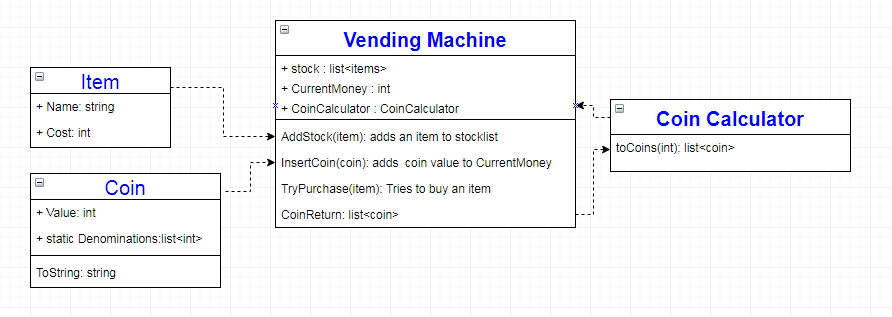

# Talk Talk tech test

## Description
A simple model representing a vending machine and a quick interface written around it for simplified user interaction.
The interface itself is very limiting in how it was written as it's designed from what a vending machine user would see, the model itself is much more flexable.

## Instructions
to try the app simply download and run the following file and follow the onscreen instructions
\talktalkTechtest\VendingApp\bin\Debug\vendingApp.exe

to run the tests:
1. download the whole repo 
2. open "VendingApp.sln" in Visual studio
3. press "ctrl + r" followed by "a"

## Improvements
Better test isolation - was having trouble figuring out how to inject coins into the vending machine without hardcoding the classname into the class. Fixing this would be my top priority as it's a lesson that would be usefull elsewhere.

I think this goes past the scope of the test, but this machine has infinite versions of whatever you put into it, and it generates cash! would change this.

## Class Diagram

## Sidenote
I've seen a very similar problem before in a game! 
shenzhen IO where you design circuits and code chips using an assembly-like language, just for fun heres my solution in the game 

